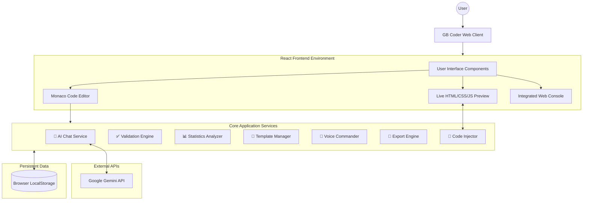

# GB Coder - AI-Powered Code Playground


<div align="center">


</div>

<br />

**GB Coder** is a state-of-the-art, AI-powered code playground designed to revolutionize how developers write, test, and learn code. Built with a modern tech stack, it integrates Google's Gemini AI to provide real-time suggestions, code explanations, and automated enhancements, all within a sleek, dark-matte user interface.

> 📘 **Full Documentation**: Check out [DOCUMENTATION.md](DOCUMENTATION.md) for a detailed guide on all features and functionalities.

---

## 🌟 Key Features

*   💬 **AI Chat Assistant**: Context-aware AI conversations about your code powered by Google Gemini, capable of explaining code, fixing bugs, and generating snippets.
*   📸 **Comprehensive Export & Share**: Generate screenshots, export as ZIP, create shareable URLs, and push directly to CodePen/JSFiddle.
*   🎤 **Voice Commands**: Control the editor entirely hands-free using 10+ voice commands (Chrome/Edge Web Speech API).
*   📐 **Code Templates Library**: Jumpstart projects instantly with 6 pre-built, production-ready templates (Navbars, Heroes, Forms, etc.).
*   📊 **Real-time Code Statistics**: Gain deep insights into your code with dynamic metrics, pattern detection, and visual complexity charts.
*   ✅ **Intelligent Code Validation**: Real-time code quality linting across HTML, CSS, and JS with 30+ rules yielding a live quality score.
*   🎨 **Custom Code Injection**: Dynamically inject custom CSS or JS presets directly into the live preview pane.
*   🌓 **Auto Theme Sync**: Deep integration with system-level theme preferences ensuring seamless Light/Dark mode transitions.
*   💻 **Advanced Editor Environment**: Professional-grade editing using the VS Code engine (`@monaco-editor/react`) featuring syntax highlighting and IntelliSense.
*   🍞 **Interactive Feedback**: Comprehensive Toast notifications confirming all major user actions dynamically.

---

## 🏗️ System Architecture



---

## ⚙️ Configuration & Setup

### **Prerequisites**
*   **Node.js**: v16.0.0 or higher
*   **npm** or **yarn**: Package manager

### **Installation Instructions**

1.  **Clone the Repository**
    ```bash
    git clone https://github.com/girishlade111/GB-Coder-Public-Beta.git
    cd GB-Coder-Public-Beta
    ```

2.  **Install Dependencies**
    ```bash
    npm install
    # or
    yarn install
    ```

### **Environment Setup**

Create a `.env` file in the root directory. You can use `.env.example` as a template.

```bash
cp .env.example .env
```

**Required Variables:**

| Variable | Description |
| :--- | :--- |
| `VITE_GEMINI_API_KEY` | **Required**. Your Google Gemini API Key. Get it from [Google AI Studio](https://aistudio.google.com/app/apikey). |

**Optional Variables:**

| Variable | Default | Description |
| :--- | :--- | :--- |
| `VITE_ENABLE_AI_SUGGESTIONS` | `true` | Toggle AI features. |
| `VITE_ENABLE_EXTERNAL_LIBRARIES` | `true` | Toggle library manager. |
| `VITE_DEV_PORT` | `5173` | Custom development port. |

> 💡 **Note**: For the AI Chat Assistant to work correctly, you must set the `VITE_GEMINI_API_KEY` in your `.env` file.

### **Running the Project**

*   **Development Server** (with HMR):
    ```bash
    npm run dev
    ```
    Visit `http://localhost:5173` to see the app.

*   **Production Build**:
    ```bash
    npm run build
    ```

*   **Preview Production Build**:
    ```bash
    npm run preview
    ```

---

## 📊 Project Stats

| Metric | Count / Detail | 
| :--- | :--- | 
| **UI Components** | ~57 feature components (`.tsx`) | 
| **Logic & Services** | ~55 hooks, utilities, services (`.ts`) | 
| **Core Dependencies** | 18 production libraries | 
| **Dev Dependencies** | 17 build & tooling libraries | 
| **Architecture** | Component-based UI with Hooks | 
| **Styling** | Utility-first Tailwind CSS | 
| **2026 Features** | 10 major newly integrated features | 

---

## 🛠️ Technology Stack

### **Frontend Core**
*   **Framework**: [React 18](https://react.dev/) - Modern component-based UI.
*   **Language**: [TypeScript 5.5](https://www.typescriptlang.org/) - Typed JS for enterprise safety.
*   **Build Tool**: [Vite 5.4](https://vitejs.dev/) - Lightning-fast frontend tooling.
*   **Styling**: [Tailwind CSS 3.4](https://tailwindcss.com/) - Rapid, flexible UI styling.

### **Editor & Interactive UI**
*   **Code Editor**: `@monaco-editor/react` - VS Code engine for the web.
*   **Icons**: `lucide-react` - Beautiful, consistent iconography.
*   **Animations**: CSS Transitions & Custom Keyframes.
*   **Notifications**: `react-hot-toast` - Instant user feedback.

### **AI & Advanced Capabilities**
*   **AI Model**: `@google/generative-ai` - Gemini Pro for chat and intelligent code assistance.
*   **Voice Recognition**: Web Speech API - Hands-free voice commands built into the browser.
*   **Image Processing**: `html-to-image` - High-quality component screenshotting.
*   **File Generation**: `jszip` - Dynamic ZIP file generation for project export.
*   **Analytics & SEO**: `react-ga4`, `web-vitals` - Tracking usage and core web metrics.

---

## 📂 Project Structure

```text
GB-Coder-Public-Beta/
├── src/
│   ├── components/        # React UI & Feature Components
│   ├── hooks/             # Custom React Hooks (useAutoSave, useTheme, etc.)
│   ├── services/          # Core Business logic & API interactions
│   ├── types/             # TypeScript definitions and interfaces
│   ├── utils/             # Helper functions & utility constants
│   ├── App.tsx            # Main Application Component Shell
│   └── main.tsx           # React Application Entry Point
├── public/                # Static assets (images, icons, manifest)
├── server/                # Backend API node services
├── .env.example           # Environment variables template
├── package.json           # Dependencies & NPM Scripts
├── tailwind.config.js     # Tailwind CSS Theme Configuration
├── tsconfig.json          # TypeScript Compiler Configuration
└── vite.config.ts         # Vite Bundler Configuration
```

---

## 🤝 Contributing

Contributions are highly welcome! To contribute:

1.  Fork the project.
2.  Create your feature branch (`git checkout -b feature/AmazingFeature`).
3.  Commit your changes (`git commit -m 'Add some AmazingFeature'`).
4.  Push to the branch (`git push origin feature/AmazingFeature`).
5.  Open a Pull Request outlining your updates.

---

## 📄 License

This project is licensed under the MIT License - see the [LICENSE](LICENSE) file for details.

---

## 📞 Contact & Credits

**Created by:** Girish Lade
*   **Instagram**: [@girish_lade_](https://www.instagram.com/girish_lade_/)
*   **Email**: girishlade111@gmail.com
*   **GitHub**: [girishlade111](https://github.com/girishlade111)

<p align="center">
  Made with ❤️ by <a href="https://ladestack.in" target="_blank">Girish Lade</a>
</p>
