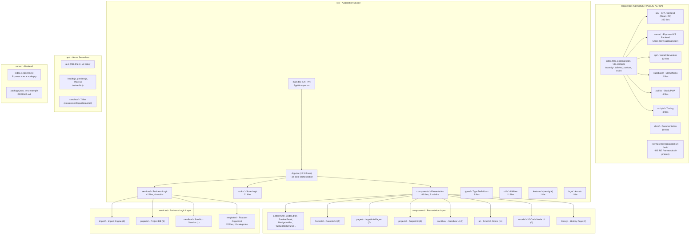

# 04 — Folder Architecture

> **Source Prompt:** PROMPT_04_Folder_Architecture.md
> **Phase:** 2 — Structural Analysis
> **Repository:** GB-CODER-PUBLIC-ALPHA
> **Commit:** b6035fee6bde521427e64f81498dd32d4c7833dc
> **Generated:** 2026-08-02 19:36:08 UTC
> **Status:** Complete
> **Confidence:** High — verified against live filesystem enumeration
> **Next Expected Document:** Phase 2/PROMPT_05_Module_Dependency_Graph.md → `05_module_dependency_graph.md`

---

## 1. Overview

This document catalogs the complete folder architecture of GB Coder — organizational pattern, directory purposes, naming conventions, architectural boundaries, and structural observations.

## 2. Methodology

- Live recursive enumeration of all directories under `src/`, `server/`, `api/`, `supabase/`, `public/`, `scripts/`, plus repo root
- File/subdirectory counts per directory from filesystem
- Convention analysis from file names, import statements, and config files (tsconfig, vite.config, eslint)
- Boundary detection from package boundaries, directory naming, and import patterns

## 3. Findings

### 3.1 Organizational Pattern

**Pattern identified:** Pattern B — Layered Architecture (with Pattern C Feature-Based elements in `services/templates/`)

**Evidence for pattern:**
- Top-level `src/` split by technical role: `components/` (presentation), `hooks/` (state logic), `services/` (business logic), `types/`, `utils/` — classic technical layering
- `services/` is the dominant layer (42 files, 4 subdirectories) — business logic isolated from UI
- All React components in a single flat `components/` directory (48 files) — presentation layer, not feature-organized
- No domain/feature directories at top level (no `projects/`, `auth/`, `editor/` feature folders in `src/`)
- **Contradictory observation:** `services/templates/` is feature-organized (11 category subdirectories: `ai-agents/`, `business/`, `ecommerce/`, `startup/`, etc.) — a feature-based island inside a layered tree
- **Contradictory observation:** `src/features/fullstack/` is a vestigial feature-based folder (1 file, 16 lines) — feature pattern attempted then abandoned
- Separate deployable units: `src/` (SPA), `server/` (standalone Express+WS, own package.json), `api/` (Vercel serverless) — **Pattern F (Microservices) at the repo root level**, layered within each

**Implications:**
- High cohesion within `services/` layer; components depend on services via hooks — clean dependency direction
- Flat `components/` (48 files) suggests growth pain — likely candidate for feature-based refactoring (evidenced by `vscode/`, `projects/`, `sandbox/` subdirectory drift)
- Template system is the only genuinely feature-organized subsystem — shows the pattern works in this codebase

### 3.2 Directory Structure Diagram (Mermaid)

### 3.3 Directory Catalog

| Directory | Depth | Purpose | Contains | Files | Boundaries |
|-----------|-------|---------|----------|-------|------------|
| `/` (root) | 1 | Build config, entry HTML, docs | index.html, package.json, vite.config.ts, tsconfig×3, tailwind/postcss/eslint config, README, CONTEXT, 30+ root .md reports | ~50 | Project boundary (own package.json) |
| `src/` | 1 | SPA frontend source | 5 top files + 6 subdirs (105 files total) | 105 | Primary source boundary (tsconfig.app.json) |
| `src/components/` | 2 | Presentation layer | 48 files, 7 subdirs | 48 | Presentation layer boundary |
| `src/components/Console/` | 3 | Console UI sub-components | TerminalTab, ConsoleTab, ValidatorTab, PreviewRunTab, ConsoleValueTree | 5 | Sub-layer boundary |
| `src/components/history/` | 3 | History page | CodeHistoryPage.tsx | 1 | Feature drift |
| `src/components/pages/` | 3 | Static info/legal pages | About, Contact, Cookie, Disclaimer, Documentation, Privacy, Terms | 7 | Page boundary |
| `src/components/projects/` | 3 | Project management UI | NewProjectModal, ProjectDashboard | 2 | Feature drift |
| `src/components/sandbox/` | 3 | Sandbox panel | SandboxPanel.tsx | 1 | Feature drift |
| `src/components/ui/` | 3 | Small UI atoms | Footer, Tooltip, Loaders, Toast, ThemeToggle, SaveStatus | 11 | Atomic UI boundary |
| `src/components/vscode/` | 3 | VSCode mode UI | VSCodeMode, FileTreeView | 2 | Feature drift |
| `src/features/` | 2 | Feature-based modules (abandoned) | fullstack/fullstackFeature.ts (16 lines) | 1 | **Dead/vestigial** |
| `src/hooks/` | 2 | Custom React hooks | 21 hooks (useLocalStorage, useProject, useCodeHistory...) | 21 | Logic layer boundary |
| `src/logo/` | 2 | Static assets | codebuddy.png | 1 | Asset boundary |
| `src/services/` | 2 | Business logic singletons | 42 files, 4 subdirs | 42 | **Service layer boundary** |
| `src/services/import/` | 3 | Import engine | importEngine.ts, projectDetection.ts | 2 | Sub-module |
| `src/services/projects/` | 3 | Project persistence | projectDatabase.ts | 1 | Sub-module |
| `src/services/sandbox/` | 3 | Cloud sandbox | sandboxSession.ts | 1 | Sub-module |
| `src/services/templates/` | 3 | Template library (feature-organized) | 20 files across 11 category subdirs | 20 | **Feature boundaries** |
| `src/services/templates/business/` | 4 | Business templates | agency, consulting, corporate, local | 4 | Category boundary |
| `src/services/templates/startup/` | 4 | Startup templates | landing (1,055 lines), waitlist | 2 | Category boundary |
| `src/services/templates/plain/` | 4 | Plain HTML templates | animation, auth, blog | 3 | Category boundary |
| `src/services/templates/react/` | 4 | React templates | dashboard, todo, weather | 3 | Category boundary |
| `src/services/templates/{ai-agents, ecommerce, nextjs, portfolio, saas, utility, vue}/` | 4 | Remaining categories | 1-2 each | 8 | Category boundary |
| `src/types/` | 2 | Shared type definitions | 9 files (ai, console.types, files, formatting, index, project...) | 9 | Type boundary |
| `src/utils/` | 2 | Pure utilities | 11 files (download, seo, monaco helpers...) | 11 | Utility boundary |
| `server/` | 1 | Backend (independent deployable) | index.js, package.json, lock, .env.example, README | 5 | **Package boundary** |
| `api/` | 1 | Vercel serverless functions | ai.js, health.js, preview.js, share.js, test-redis.js | 5 | Serverless boundary |
| `api/sandbox/` | 2 | Sandbox serverless functions | _detect, _shared, close, create, exec, logs, start | 7 | Sub-module |
| `supabase/` | 1 | Database schema | schema.sql, migration.sql | 2 | DB boundary |
| `public/` | 1 | Static/PWA assets | manifest.json, robots.txt, sitemap.xml, tghjkl.jpeg | 4 | Public boundary |
| `scripts/` | 1 | Development tooling | 2 template generators, bundle measurer | 3 | Tooling boundary |
| `docs/` | 1 | Documentation | 10 feature docs + reverse-engineering/ | 10+ | Doc boundary |
| `Hermes With Deepseek v4 flash/` | 1 | RE framework (meta) | 9 phase folders, 27 prompts, OUTPUT_RULES | ~30 | Meta boundary (excluded from app analysis) |

### 3.4 Naming Conventions

| Scope | Convention | Example | Exceptions |
|-------|-----------|---------|------------|
| React components | PascalCase.tsx | `PreviewPanel.tsx` | None found |
| Services | camelCase.ts | `projectStore.ts` | `voiceIntentRegistry.ts` follows same |
| Hooks | `use` + PascalCase.ts | `useLocalStorage.ts` | None found |
| Types | camelCase.types.ts / short names | `console.types.ts`, `project.ts` | `vendor-modules.d.ts` (dot suffix) |
| Utils | camelCase.ts | `downloadUtils.ts` | None found |
| Directories (components) | lowercase single-word | `ui/`, `pages/` | `vscode/`, `Console/` (capitalized — inconsistent) |
| Directories (templates) | kebab-case | `ai-agents/`, `ecommerce/` | None found |
| Serverless | lowercase.js | `ai.js`, `health.js` | `_shared.js`, `_detect.js` (underscore prefix = internal) |
| Test files | NONE exist | — | 0 test files in repo |
| Template files | camelCase.ts | `corporate.ts`, `landing.ts` | None found |
| Config files | kebab/dot | `tsconfig.app.json`, `.env.example` | None found |

### 3.5 Architectural Boundaries

| Boundary | Type | Enforced By | Strength |
|----------|------|-------------|----------|
| `src/` vs `server/` vs `api/` | Package boundary | Separate package.json (server), Vercel routing (api) | **Strong** |
| `src/components/` vs `src/services/` | Presentation vs. logic | Directory convention + hooks mediation | Strong |
| `src/services/` vs `src/hooks/` | Service vs. hook | Convention (hooks call services) | Strong |
| `src/types/` | Type isolation | tsconfig project references | Strong |
| `api/sandbox/_*.js` | Internal serverless helper | Underscore prefix convention | Medium (convention only) |
| `src/services/templates/*` categories | Feature/category | Directory convention | Strong |
| `src/features/` | Intended feature boundary | **None** (abandoned) | **Dead** |
| `components/{vscode,projects,sandbox,Console}` | Feature drift | None — convention violation | Weak |

### 3.6 Structural Observations

- **What's well-organized:**
  - Clean layer separation: components → hooks → services → utils/types
  - Services are true singletons with consistent storage patterns (localStorage-backed)
  - `templates/` feature organization is exemplary — 11 clear categories
  - API boundary between SPA, server, and serverless is clean and intentional
- **What's inconsistent:**
  - `components/` contains feature subdirs (`vscode/`, `projects/`, `sandbox/`, `Console/` capitalized, `history/`) mixed with 30 flat files — pattern abandoned midway
  - `src/features/` started then abandoned (1 vestigial file)
  - Root has 30+ loose `.md` report files (fix logs, guides) — documentation sprawl
  - `components/ui/` mixes atoms (Tooltip) with domain toasts (FormatToast)
- **Structural debt:**
  - `App.tsx` at 4,211 lines — monolithic orchestration; components import from a single mega-file context
  - `services/templateService.ts` at 2,930 lines — near-god service
  - Flat `components/` at 48 files with no index/barrel files
- **Notable absences:**
  - No test directories/files anywhere (0 tests)
  - No `src/api/` client layer — network calls likely inline in services/components
  - No state management directory (no Redux/Zustand stores — all useState + localStorage)
  - No `__tests__`, no `stories/`, no CI config
  - No `assets/` or `styles/` directory (index.css only, Tailwind in config)

---

## 4. Quality Gate Checklist (P04)

- [X] Organizational pattern identified with evidence
- [X] All top-level directories documented
- [X] All architecturally significant subdirectories documented
- [X] Mermaid directory structure diagram generated
- [X] Naming conventions cataloged
- [X] Architectural boundaries identified
- [X] Structural observations documented

---

## Verification

- Directory counts verified by live `Get-ChildItem -Recurse` enumeration
- `src/features/` confirmed vestigial: only `fullstack/fullstackFeature.ts` (16 lines)
- Zero test files confirmed: `Get-ChildItem -Recurse -Include *.test.*,*.spec.*` = 0

## Next Phase

Proceed to **[Phase 2: PROMPT_05_Module_Dependency_Graph.md](../Hermes%20With%20Deepseek%20v4%20flash/Phase%202%20—%20Structural%20Analysis/PROMPT_05_Module_Dependency_Graph.md)** after this document passes quality gate Q1.

## Document Status

[X] Draft — initial analysis, pending review
[ ] Reviewed — peer-checked against source code
[X] Complete — passed quality gate Q1
